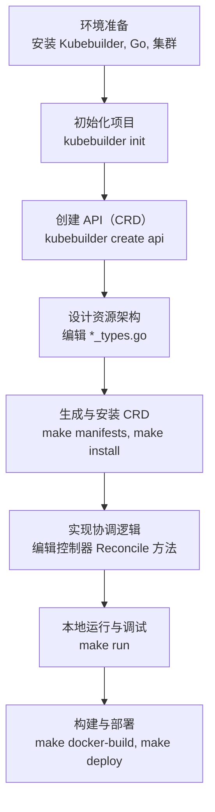

### 项目开发详细步骤
1. brew install kubebuilder

2. cd ~/code/go/cyk

3. mkdir k8s-opreator

4. cd k8s-opreator

5. go mod init k8s-opreator

6. kubebuilder init --domain cyk.io

7. kubebuilder create api --group myservice --version v1 --kind Apiservice

8. 在api/v1/apiservice_types.go中的spec和status中添加自己想要的字段

9. 在internal/controller/apiservice_controller.go 中的Reconcile 函数中编写控制器逻辑（这是最核心也是最关键的）

10. make manifests 生成CRD与RBAC清单，产物位于config/crd/和config/rbac/

11. make docker-build IMG=my-operator:v0.1 根据 Dockerfile 构建出Operator的镜像。

12 整体备份config目录后，然后删除config下，一些非必须的yaml文件和目录，近保留如下目录和文件
    cp -r config  config.bak
     config/
    ├── crd/                      # 全部保留
    ├── rbac/                     # 全部保留  
    ├── manager/                  # 全部保留
    ├── default/kustomization.yaml # 全部保留
    └── samples/                  # 全部保留

13. make build-installer  IMG=my-operator:v0.1 此命令会创建一个dist文件夹，并在文件夹下生成一份整合的 install.yaml

14. 最后把11中的镜像打包后和12中的install.yaml， 一起上传到k8s集群中去

15. 在k8s中 kubectl apply -f install.yaml。 并把相应的镜像load到对应的节点上去

16. 验证是否部署成功(详见./images/控制器部署成功图.png)  kubectl get po -n k8s-opreator-system -o wide; kubectl logs -f $podName -n k8s-opreator-system

17. 完善config/samples/myservice_v1_apiservice.yaml 文件，并上传到k8s进行部署

18. 第一次部署myservice_v1_apiservice.yaml失败了，原因是控制器逻辑里，我有list deployment资源的动作，但是rbac没有授权，报错如下
```
2025-12-15T18:51:05Z    ERROR   controller-runtime.cache.UnhandledError Failed to watch {"reflector": "pkg/mod/k8s.io/client-go@v0.34.1/tools/cache/reflector.go:290", "type": "*v1.Deployment", "error": "failed to list *v1.Deployment: deployments.apps is forbidden: User \"system:serviceaccount:k8s-opreator-system:k8s-opreator-controller-manager\" cannot list resource \"deployments\" in API group \"apps\" at the cluster scope"}
```

19. 删除pod，删除控制器，修改install.yaml，在rbac部分的manager-role角色下，增加对deployment的增删改查的权限

20  重新部署install.yaml 和 myservice_v1_apiservice.yaml

21  查看pod是否有正常拉起来，并进行访问验证，成功截图参照./images/crd应用部署成功图.pnd


---
---
---

### 各个组件用途及关系，参照images下各个截图说明


---
---
---

使用 Kubebuilder 开发 CRD Operator，核心是创建一个“控制器”（Controller），让它能够监听你定义的“自定义资源”（CR），并自动执行管理逻辑，使集群的实际状态与你声明的期望状态一致。整个过程可以分为几个清晰的阶段。

下面这张图概括了使用 Kubebuilder 开发 Operator 的核心工作流，可以帮助你建立整体概念：


### 🔧 **第一阶段：开发前准备**

这个阶段的目标是搭建一个可以编译、运行和测试 Operator 的基础环境。

*   **要做的事**：
    1.  **安装 Go**：Kubebuilder 本身和 Operator 代码都用 Go 编写，这是必备语言环境。
    2.  **安装 Kubebuilder CLI**：这是主要的脚手架和代码生成工具。
    3.  **准备 Kubernetes 集群**：用于最终部署和测试。可以使用 Minikube、Kind 或任何现有集群。
    4.  **安装 Docker**：用于构建 Operator 的容器镜像。
    5.  **（可选）配置 Kustomize**：Kubebuilder 用它来管理部署清单文件的定制。

*   **目的**：准备好所有必要的工具链，确保你能顺利执行后续的创建、构建和部署命令。

*   **工具/组件**：
    *   **Kubebuilder**：核心开发工具包，由 Kubernetes SIG API Machinery 社区维护。
    *   **Go 工具链**：官方提供。
    *   **Docker**：容器化工具。
    *   **Kustomize**：Kubernetes 原生配置管理工具，已集成在 Kubebuilder 中。

### 🏗️ **第二阶段：初始化项目**

*   **要做的事**：在终端执行 `kubebuilder init --domain <你的域名>`，例如 `--domain mycompany.com`。
*   **目的**：创建一个结构规范、包含所有标准配置（如 Makefile、Dockerfile、依赖声明 `go.mod`）的 Go 项目目录。这奠定了项目的基础骨架。
*   **工具/组件**：
    *   **Kubebuilder Init 插件**：执行项目脚手架生成。

### 📄 **第三阶段：创建 API（定义 CRD）**

*   **要做的事**：执行命令 `kubebuilder create api --group <组名> --version <版本> --kind <资源种类>`。例如，创建一个 `Guestbook` API：`--group webapp --version v1 --kind Guestbook`。
*   **目的**：
    1.  生成**自定义资源定义（CRD）** 的 Go 类型文件（`api/v1/<kind>_types.go`）。你在这里定义资源的 Spec（期望状态）和 Status（实际状态）字段。
    2.  生成对应的**控制器框架文件**（`controllers/<kind>_controller.go`），其中包含需要你填充核心逻辑的 `Reconcile` 函数。
    3.  生成 CRD 安装所需的 YAML 清单。
*   **工具/组件**：
    *   **Kubebuilder Create API 插件**：生成 API 和控制器代码框架。
    *   **controller-gen**：一个代码生成器（通过 `make manifests` 调用），它读取 Go 源文件中的特殊标记（如 `//+kubebuilder:subresource:status`），并生成 CRD YAML 文件以及 RBAC 规则等。

### ✏️ **第四阶段：设计资源与实现控制器**

这是编写业务逻辑的核心环节。

*   **要做的事与目的**：
    1.  **编辑 `*_types.go` 文件**：在 `Spec` 和 `Status` 结构体中添加你的自定义字段（例如，为 `Guestbook` 添加 `FirstName`、`ReplicaCount` 等字段）。这定义了你的 CR “长什么样”。
    2.  **生成 CRD 清单**：运行 `make manifests`。此命令会调用 `controller-gen`，根据你在 Go 文件中添加的字段和标记，更新 `config/crd/` 目录下的 CRD YAML 定义文件。
    3.  **实现 `Reconcile` 逻辑**：编辑 `controllers/*_controller.go` 文件中的 `Reconcile(ctx context.Context, req ctrl.Request)` 方法。这是控制器的“大脑”，你需要在这里编写：**如何根据 CR 实例的 Spec 声明，去创建、更新或删除其他 Kubernetes 资源（如 Deployment、Service），以驱动集群达到期望状态**。
*   **涉及的核心概念与组件**：
    *   **Manager**：Kubebuilder 项目的核心控制器，负责运行你注册的所有控制器、管理共享缓存和与 API Server 的客户端连接。
    *   **Cache**：由 Manager 初始化的本地缓存，负责监听并缓存你关心的资源对象，避免频繁查询 API Server，并触发控制器的事件处理。
    *   **Client**：用于读写 Kubernetes 资源的客户端。从 Cache 中读取（查询），直接向 API Server 写入（修改）。
    *   **Scheme**：一种映射关系，用于在 Kubernetes API 中的 **GVK（GroupVersionKind）** 和你代码中的 **Go Type** 之间进行转换。这是控制器理解它要处理哪种资源的“字典”。

### 🚀 **第五阶段：测试、构建与部署**

*   **要做的事与目的**：
    1.  **安装 CRD**：运行 `make install`。这会将你生成的 CRD 部署到当前连接的 Kubernetes 集群中。之后，你就可以使用 `kubectl get <你的CRD>` 了。
    2.  **本地运行调试**：运行 `make run`。这会在你的本地机器上启动控制器，方便你快速测试和调试 `Reconcile` 逻辑，观察日志输出。
    3.  **构建与推送镜像**：运行 `make docker-build docker-push IMG=<你的镜像地址:标签>`。这会将你的控制器打包成容器镜像。
    4.  **部署到集群**：运行 `make deploy IMG=<你的镜像地址:标签>`。这会在集群（默认在独立的命名空间中）部署一个包含你的控制器的 Deployment。
    5.  **创建 CR 实例进行验证**：应用 `config/samples/` 目录下的示例 YAML 文件，或自己创建一个 CR，观察控制器是否按预期工作。
*   **工具/组件**：
    *   **Makefile**：Kubebuilder 生成的构建脚本，封装了所有复杂命令。
    *   **Kustomize**：在 `make deploy` 时被调用，用于组装最终的部署清单。

### ⚙️ **第六阶段：配置与进阶**

根据 Operator 的复杂度，你可能需要配置以下特性：

*   **作用域（Scope）**：你的 CRD 可以是 **Namespaced**（默认，资源属于某个命名空间）或 **Cluster**（集群级资源）。在创建 API 时可通过 `--namespaced=false` 指定，或在 Go 文件中使用 `//+kubebuilder:resource:scope=Cluster` 标记修改。Manager 本身也可以配置为监听特定或全部命名空间。
*   **Webhook**：用于在对象持久化到集群**之前**（验证/变更）或**之后**（默认）进行拦截。运行 `kubebuilder create webhook` 可以创建框架。这允许你实现更复杂的默认值注入、字段校验和业务逻辑。
*   **多版本 API**：允许你的 CRD 拥有多个版本（如 `v1alpha1`, `v1beta1`, `v1`），并通过转换机制进行版本间切换。这需要精心的设计。

### 📝 总结与建议

整个过程可以总结为：**用 Kubebuilder 脚手架生成项目框架和代码 -> 设计你的 CRD 数据结构 -> 实现控制器调谐（Reconcile）逻辑 -> 通过标准 Go 工具链构建和部署。**

对于初学者，建议严格遵循上述流程，并使用 `make run` 进行充分调试。在开始实际项目前，理解 **Informer、Cache、Scheme、Client** 这些  中提到的组件如何协作，会让你在编写 `Reconcile` 函数和排查问题时更加得心应手。

如果你能告诉我你希望开发的 Operator 具体管理什么样的应用或中间件，我可以提供更具体的字段设计和 `Reconcile` 逻辑思路。


---
---
---


# k8s-opreator
// TODO(user): Add simple overview of use/purpose

## Description
// TODO(user): An in-depth paragraph about your project and overview of use

## Getting Started

### Prerequisites
- go version v1.24.6+
- docker version 17.03+.
- kubectl version v1.11.3+.
- Access to a Kubernetes v1.11.3+ cluster.

### To Deploy on the cluster
**Build and push your image to the location specified by `IMG`:**

```sh
make docker-build docker-push IMG=<some-registry>/k8s-opreator:tag
```

**NOTE:** This image ought to be published in the personal registry you specified.
And it is required to have access to pull the image from the working environment.
Make sure you have the proper permission to the registry if the above commands don’t work.

**Install the CRDs into the cluster:**

```sh
make install
```

**Deploy the Manager to the cluster with the image specified by `IMG`:**

```sh
make deploy IMG=<some-registry>/k8s-opreator:tag
```

> **NOTE**: If you encounter RBAC errors, you may need to grant yourself cluster-admin
privileges or be logged in as admin.

**Create instances of your solution**
You can apply the samples (examples) from the config/sample:

```sh
kubectl apply -k config/samples/
```

>**NOTE**: Ensure that the samples has default values to test it out.

### To Uninstall
**Delete the instances (CRs) from the cluster:**

```sh
kubectl delete -k config/samples/
```

**Delete the APIs(CRDs) from the cluster:**

```sh
make uninstall
```

**UnDeploy the controller from the cluster:**

```sh
make undeploy
```

## Project Distribution

Following the options to release and provide this solution to the users.

### By providing a bundle with all YAML files

1. Build the installer for the image built and published in the registry:

```sh
make build-installer IMG=<some-registry>/k8s-opreator:tag
```

**NOTE:** The makefile target mentioned above generates an 'install.yaml'
file in the dist directory. This file contains all the resources built
with Kustomize, which are necessary to install this project without its
dependencies.

2. Using the installer

Users can just run 'kubectl apply -f <URL for YAML BUNDLE>' to install
the project, i.e.:

```sh
kubectl apply -f https://raw.githubusercontent.com/<org>/k8s-opreator/<tag or branch>/dist/install.yaml
```

### By providing a Helm Chart

1. Build the chart using the optional helm plugin

```sh
kubebuilder edit --plugins=helm/v2-alpha
```

2. See that a chart was generated under 'dist/chart', and users
can obtain this solution from there.

**NOTE:** If you change the project, you need to update the Helm Chart
using the same command above to sync the latest changes. Furthermore,
if you create webhooks, you need to use the above command with
the '--force' flag and manually ensure that any custom configuration
previously added to 'dist/chart/values.yaml' or 'dist/chart/manager/manager.yaml'
is manually re-applied afterwards.

## Contributing
// TODO(user): Add detailed information on how you would like others to contribute to this project

**NOTE:** Run `make help` for more information on all potential `make` targets

More information can be found via the [Kubebuilder Documentation](https://book.kubebuilder.io/introduction.html)

## License

Copyright 2025.

Licensed under the Apache License, Version 2.0 (the "License");
you may not use this file except in compliance with the License.
You may obtain a copy of the License at

    http://www.apache.org/licenses/LICENSE-2.0

Unless required by applicable law or agreed to in writing, software
distributed under the License is distributed on an "AS IS" BASIS,
WITHOUT WARRANTIES OR CONDITIONS OF ANY KIND, either express or implied.
See the License for the specific language governing permissions and
limitations under the License.

